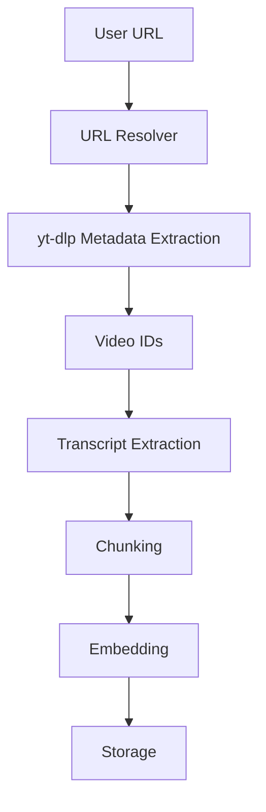
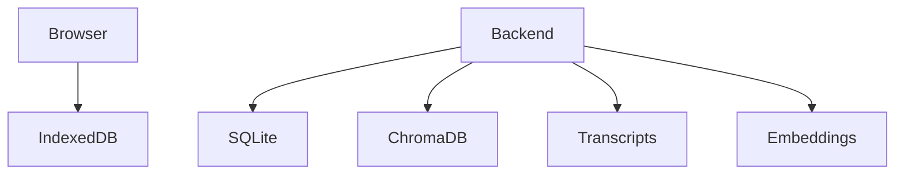

# Channel Indexing Architecture

## Purpose

Allow users to index both playlist URLs and channel URLs through the same interface.

Supported examples:

- `https://youtube.com/@freecodecamp`
- `https://youtube.com/@3blue1brown`
- `https://youtube.com/@fireship`
- `https://youtube.com/@andrewhuberman`

The system should automatically discover all public videos, extract transcripts, generate embeddings, and allow semantic search across the entire channel.

## Design Goal

The user should not care whether the source is a playlist or a channel.

Both should work through the same interface:

1. Paste any YouTube URL
2. Index
3. Ask questions

## User Experience

### Current

Paste playlist URL

Index

Ask questions

### New

Paste any YouTube URL

Supported:

- Playlist
- Channel
- `@Handle`
- Single video

Index

Ask questions

## URL Types Supported

- Playlist: `https://youtube.com/playlist?list=PL...`
- Channel handle: `https://youtube.com/@freecodecamp`
- Channel ID: `https://youtube.com/channel/UC...`
- Videos tab: `https://youtube.com/@freecodecamp/videos`
- Single video: `https://youtube.com/watch?v=...`

## URL Resolution Service

Create `url_resolver.py`.

Expected output format:

```json
{
  "type": "playlist",
  "id": "PLxxx"
}
```

or:

```json
{
  "type": "channel",
  "id": "UCxxx"
}
```

or:

```json
{
  "type": "video",
  "id": "abc123"
}
```

## yt-dlp Integration

Since the project uses the free stack, `yt-dlp` becomes the primary source.

### Why

`yt-dlp` already supports:

- Playlist URLs
- Channel URLs
- `@Handle` URLs
- Video URLs

This removes the need for additional APIs in the common path.

## Unified Ingestion Flow



Everything downstream remains identical.

## Database Changes

### Sources Table

Instead of separate playlists, create a unified `sources` table.

| Column | Type | Notes |
| --- | --- | --- |
| id | UUID | Primary key |
| source_type | string | `playlist`, `channel`, or `video` |
| source_title | string | Display title |
| source_url | string | Original URL |
| created_at | datetime | Insert time |
| last_indexed_at | datetime | Used for incremental sync |

Example:

- `id = src_001`
- `source_type = channel`
- `source_title = freeCodeCamp`
- `source_url = https://youtube.com/@freecodecamp`

### Videos Table

| Column | Notes |
| --- | --- |
| id | Primary key |
| source_id | Foreign key to `sources` |
| video_id | YouTube video ID |
| title | Video title |
| duration | Duration in seconds |
| published_at | Publish date |

### Chunks Table

| Column | Notes |
| --- | --- |
| id | Primary key |
| source_id | Foreign key to `sources` |
| video_id | YouTube video ID |
| text | Transcript chunk text |
| start_seconds | Chunk start time |
| end_seconds | Chunk end time |

## Chroma Metadata

Store metadata like this:

```json
{
  "source_id": "src_001",
  "source_type": "channel",
  "video_id": "abc123",
  "start_seconds": 842
}
```

## Query Filtering

### Current

```python
where={
    "playlist_id": playlist_id
}
```

### New

```python
where={
    "source_id": source_id
}
```

This works for:

- playlist
- channel
- video

## Large Channel Protection

Some channels have:

- 100 videos
- 500 videos
- 1000 videos
- 5000 videos

### Index Limits

For hosted deployment:

- Default: 100 videos
- Advanced: user can increase

Example warning:

> This channel contains 1,247 videos.
>
> Estimated indexing time: 42 minutes.
>
> Index first 100 videos?

Buttons:

- Index
- Customize

## Incremental Channel Sync

Store `last_indexed_at`.

When re-indexing:

1. Fetch latest videos
2. Compare video IDs
3. Only process new videos

### Benefits

- Faster
- Cheaper
- Less duplicate work

## Channel Statistics

Display channel-level stats such as:

- Channel: freeCodeCamp
- Videos indexed: 437
- Transcript coverage: 92%
- Chunks: 48,293
- Embeddings: 48,293

## Search Modes

Add search scope options:

- Entire channel
- Specific video
- Date range

Examples:

- How does freeCodeCamp explain React?
- Search only: React Crash Course
- Videos from 2024 onwards

## Hosted Deployment Strategy

Store on the server:

- Channel metadata
- Videos
- Transcripts
- Embeddings

Store in browser storage:

- API keys
- Settings
- Chat history

This matches the current architecture direction.

## Self-Hosted Strategy

When users clone the project:

```bash
git clone ...
docker compose up
```

Everything stays local:



No shared storage.

No external accounts required.

## Future Enhancement

After channel indexing is stable, add a workspace layer:

```text
Workspace
├── Playlist 1
├── Playlist 2
├── Channel 1
├── Channel 2
```

Then support asking across all indexed sources.

Example:

> Compare how 3Blue1Brown and StatQuest explain gradient descent.

This would make the product significantly stronger than a standard YouTube RAG chatbot.