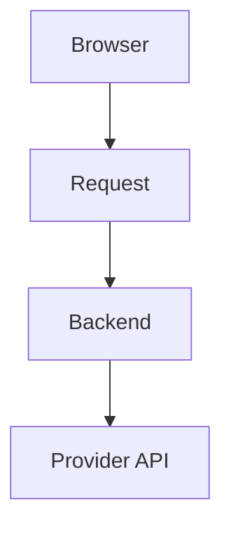

# Deployment & Storage Architecture

## Purpose

This document defines how TubeRAG manages:

- User API keys
- User settings
- Chat history
- Indexed content
- Embeddings
- Transcripts

across two deployment modes:

- Public hosted deployment
- Self-hosted / local deployment

The goal is to provide:

- Privacy
- Low operational cost
- Good scalability
- Easy deployment
- Flexibility for self-hosted users

## Core Philosophy

TubeRAG follows a hybrid-storage architecture.

User-specific data remains on the user's device whenever possible.

Heavy AI processing data remains wherever the application is running.

This minimizes:

- Backend complexity
- User account requirements
- API key management burden
- Storage costs

## Deployment Modes

### Mode 1: Public Hosted Application

Example:

`https://tuberag.app`

Users access the application through a public URL.

#### Browser Storage

Stored on the user's device:

- Provider
- API key
- Chat history
- UI preferences
- Theme settings

#### Server Storage

Stored on TubeRAG servers:

- Transcripts
- Chunks
- Embeddings
- Chroma collections
- Indexed videos

#### Benefits

- Small browser footprint
- Fast indexing
- Shared infrastructure
- Simple user experience

#### Tradeoff

Users do not own indexed data.

The hosted server owns:

- Embeddings
- Transcripts
- Indexes

### Mode 2: Self-Hosted Deployment

Example:

```bash
git clone ...
docker compose up
```

Everything runs on the user's machine.

#### Local Browser Storage

Stored in browser:

- Provider
- API key
- Chat history
- Settings

#### Local Backend Storage

Stored on the user's machine:

- ChromaDB
- SQLite
- Transcripts
- Embeddings
- Video metadata

#### Benefits

- 100% ownership
- No shared infrastructure
- No external storage dependency

#### Tradeoff

Requires local resources.

## Storage Architecture

### Browser Storage

#### Recommended Technology

- IndexedDB

#### Library

- Dexie.js

#### Stored Objects

##### Settings

```ts
interface UserSettings {
  provider: string;
  model: string;
  temperature: number;
}
```

##### API Keys

```ts
interface ProviderKey {
  provider: string;
  apiKey: string;
}
```

##### Chat History

```ts
interface ChatSession {
  id: string;
  createdAt: Date;
  messages: Message[];
}
```

##### UI Preferences

```ts
interface Preferences {
  theme: string;
  animationsEnabled: boolean;
}
```

### Backend Storage

#### ChromaDB

Stores:

- Embeddings
- Chunk metadata
- Chunk references

Example:

```json
{
  "chunk_id": "abc123",
  "video_id": "xyz",
  "playlist_id": "pl001",
  "start_seconds": 542
}
```

#### SQLite

Stores:

- Playlist metadata
- Video metadata
- Indexing status

#### Transcript Cache

Stores:

- Raw transcript segments

Purpose:

- Avoid repeated transcript extraction

## BYOK (Bring Your Own Key)

### Philosophy

TubeRAG does not require user accounts.

Users provide their own AI provider key.

### Supported

- Grok
- Gemini
- OpenAI
- Anthropic
- Ollama

### Key Storage Rules

#### Hosted Deployment

Stored only in browser.

Never stored in backend database.

Never logged.

Never persisted on server.

Flow:



The key is sent with requests but is not stored.

#### Self-Hosted Deployment

Users may choose:

- Browser storage
- `.env` file

for convenience.

## Data Privacy

### TubeRAG Never Stores

Hosted version:

- User accounts
- Passwords
- Personal information
- Provider keys

### TubeRAG Stores

Hosted version:

- Indexed videos
- Transcripts
- Embeddings

for application functionality.

## Data Management Controls

### Clear Current Chat

Removes:

- Current conversation

Keeps:

- API keys
- Settings

### Clear All Chats

Removes:

- All conversations

Keeps:

- API keys
- Settings

### Remove API Key

Removes:

- Provider key

Keeps:

- Chats
- Settings

### Clear Local Settings

Removes:

- Theme
- Preferences
- Provider selection

Keeps:

- Chats

### Reset Local Data

Removes:

- API keys
- Chats
- Settings
- Cached metadata

Equivalent to:

```ts
indexedDB.deleteDatabase("TubeRAG")
localStorage.clear()
```

## Storage Usage Strategy

### Browser Storage Limits

Do not store:

- Embeddings
- Transcripts
- Vector indexes

in the hosted deployment.

Reason:

- Can grow to hundreds of MB

### Browser Stores Only

- Keys
- Chats
- Preferences

Expected usage:

- Less than 10 MB for most users

### Self-Hosted Flexibility

When running locally:

- Frontend
- Backend
- ChromaDB
- SQLite

all execute on the user's machine.

In this mode:

- Embeddings
- Transcripts
- Indexes

are stored locally by the backend.

This allows complete ownership of data and eliminates dependence on any shared infrastructure.

## Design Principle

Hosted version:

- Light browser storage
- Heavy server storage

Self-hosted version:

- Light browser storage
- Heavy local backend storage

This architecture provides:

- No user accounts required
- No server-side API key storage
- Low hosting complexity
- Privacy-focused design
- Easy self-hosting
- Scalable public deployment
- Clear user-controlled data deletion