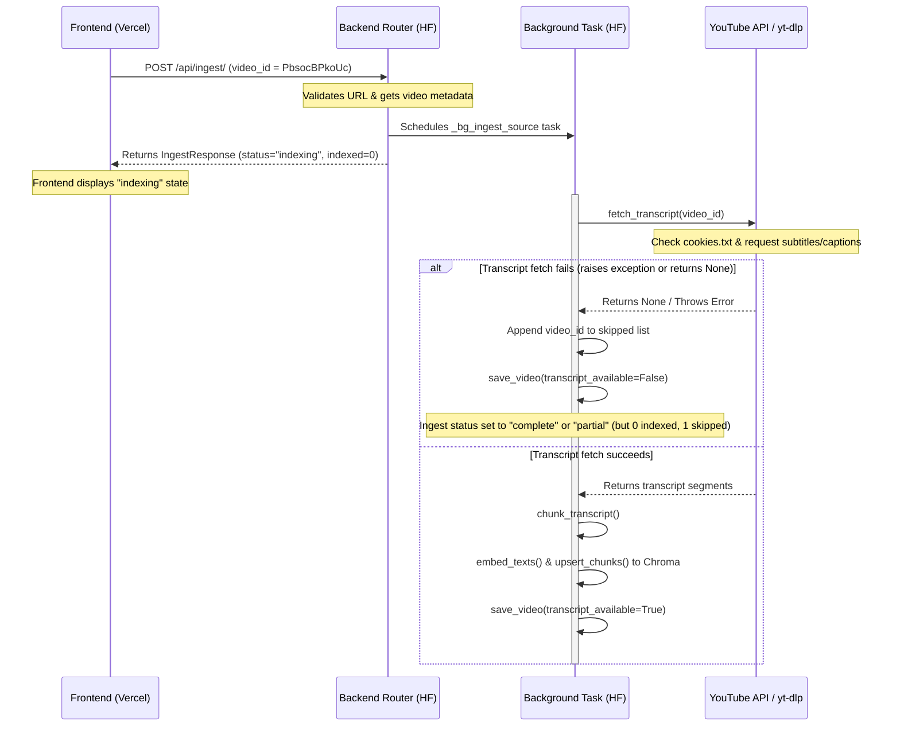

# TubeRAG Architectural & Development Summary Report

This report provides a detailed, chronological history of the TubeRAG application development. It details the technical architectural design, files modified, development steps, challenges faced, solutions implemented, and the active troubleshooting steps for the current ingestion issue.

---

## 1. Project Architecture & Deployment Overview

To deliver a production-ready, $0/mo hosting setup with minimal maintenance, we designed a split architecture:

1.  **Frontend (React + Vite + TypeScript)**: Hosted on **Vercel** ($0/mo static hosting tier).
2.  **Backend (FastAPI + SQLite + Chroma DB + PyTorch)**: Hosted on **Hugging Face Spaces** ($0/mo CPU Basic, 16GB RAM container).
3.  **Database Storage**: Episodic and ephemeral SQLite and Chroma database storage. When the Hugging Face Space sleeps or restarts, the database automatically clears, preventing storage bloat on the free tier. When the user clears sources, it triggers database deletion.

---

## 2. Chronological History of Development (Initial Phase)

### Step 1: Frontend Configuration & Groq API Integration
*   **User Goal:** Host the React frontend on Vercel and configure the Groq LLM API keys securely without server costs.
*   **Implementation & Rationale:**
    *   Vercel serverless edge functions have a hard 10-second timeout, which is too short for large YouTube transcript ingestion or long LLM generation streams.
    *   To bypass this, we configured the frontend [client.ts](file:///c:/Users/satya/Desktop/projects/youtube-rag/frontend/src/api/client.ts) to send requests directly from the user's browser to the Hugging Face backend using the environment variable `VITE_API_URL`.
    *   We stored the user's **Groq API Key** locally in the browser (via the application Settings modal) and passed it to the backend on each request via the headers `x-api-key` and `x-provider: groq`. This keeps the backend stateless, keyless, and free from security risks related to sharing API keys.

### Step 2: Backend Containerization & Local WSL2 Network Resolution
*   **User Goal:** Package the FastAPI application into a Docker container for deployment to Hugging Face Spaces.
*   **Challenge:** During local container build testing under WSL2 (Windows Subsystem for Linux), the container failed to resolve external domain names (e.g., PyPI or Hugging Face repository addresses).
*   **Solution:** Identified a WSL2 DNS configuration bug. Resolved this by adding explicit public DNS servers (`8.8.8.8`, `1.1.1.1`) inside the `docker-compose.yml` network configurations to bypass local Windows loopback issues.

### Step 3: Docker Dependency & Build Optimization
*   **Challenge:** The default installation of PyTorch (`torch`) via pip pulls the CUDA-enabled binary, which is over 1.5GB in size. This causes container build failures, network timeouts, and disk quota issues on the Hugging Face free tier.
*   **Solution:** Modified the [Dockerfile](file:///c:/Users/satya/Desktop/projects/youtube-rag/Dockerfile) to explicitly target the PyTorch CPU-only index URL:
    ```dockerfile
    RUN pip install --no-cache-dir torch==2.3.0 --index-url https://download.pytorch.org/whl/cpu
    ```
    This reduced the container build download size from 1.5GB to approximately 150MB, ensuring fast builds and fitting easily within Hugging Face Spaces limits. We also configured `.dockerignore` files in the [backend](file:///c:/Users/satya/Desktop/projects/youtube-rag/backend/.dockerignore) and [frontend](file:///c:/Users/satya/Desktop/projects/youtube-rag/frontend/.dockerignore) to exclude heavy local virtual environments (`venv/`) and compiler caches (`__pycache__/`).

### Step 4: Hugging Face Datacenter IP Block (YouTube Anti-Bot Check)
*   **User Action:** Attempted to ingest video `gwS8lN_gLXY` on the live Hugging Face backend space.
*   **Challenge:** The ingestion failed, and Hugging Face logs showed:
    `ERROR: [youtube] gwS8lN_gLXY: Sign in to confirm you're not a bot.`
    *   *Root Cause:* YouTube blocks anonymous requests coming from cloud/datacenter IP subnets (such as Hugging Face's AWS machines).
*   **Solution:** Integrated dynamic cookie support in [youtube_service.py](file:///c:/Users/satya/Desktop/projects/youtube-rag/backend/app/services/youtube_service.py) and [transcript_service.py](file:///c:/Users/satya/Desktop/projects/youtube-rag/backend/app/services/transcript_service.py). The services check for the existence of `cookies.txt` (or `/app/cookies.txt`) and supply it as the `cookiefile` parameter for `yt-dlp` and `cookies` parameter for `youtube_transcript_api`.

### Step 5: Automated GitHub-to-Hugging Face Space Sync Workflow
*   **Action:** Configured a GitHub Actions workflow in [.github/workflows/sync.yml](file:///c:/Users/satya/Desktop/projects/youtube-rag/.github/workflows/sync.yml) using the `huggingface/hub-sync` action. Whenever code is pushed to `origin/main` on GitHub, the workflow automatically pushes the codebase to the Hugging Face Space repository, triggering a redeployment.

---

## 3. Post-Deployment Integration & Optimization Tasks

After successfully building the Docker image and setting up the basic backend space, we performed the following integration tasks to link the backend and frontend:

### Task A: Backend CORS Configuration for Vercel Domains
*   **Goal:** Allow the frontend hosted on Vercel to query the Hugging Face Spaces backend directly from users' browsers without security blockades.
*   **Implementation:**
    *   Vercel deploys previews and production deployments to dynamic URLs (e.g., `youtube-rag-two.vercel.app` or `<project-name>-<hash>-<user>.vercel.app`).
    *   We added an `allow_origin_regex` pattern matching all subdomains of Vercel inside [main.py](file:///c:/Users/satya/Desktop/projects/youtube-rag/backend/app/main.py):
        ```python
        app.add_middleware(
            CORSMiddleware,
            allow_origins=origins,
            allow_origin_regex=r"https://.*\.vercel\.app",
            allow_credentials=True,
            allow_methods=["*"],
            allow_headers=["*"],
        )
        ```
    *   This ensures all browser requests from any Vercel deployment of this project bypass CORS blocks.

### Task B: Database Storage Auto-Cleanup Hooks
*   **Goal:** Since Hugging Face Spaces run on ephemeral local storage, we wanted to ensure user actions also clean up backend files to prevent DB bloat.
*   **Implementation:**
    *   Modified the frontend React [App.tsx](file:///c:/Users/satya/Desktop/projects/youtube-rag/frontend/src/App.tsx) component.
    *   When a user clicks "Clear Source" or "Clear All Sources", the frontend now triggers a network call to the backend's `/api/sources/{source_id}` DELETE endpoint.
    *   This deletes the corresponding video embeddings from Chroma DB and the metadata from SQLite, cleaning up space.

### Task C: Dark Mode Styling & Accessibility Fixes
*   **Goal:** Solve a readability issue on the frontend Settings modal where option dropdowns were unreadable.
*   **Implementation:**
    *   Modified [SettingsModal.tsx](file:///c:/Users/satya/Desktop/projects/youtube-rag/frontend/src/components/SettingsModal.tsx) styles.
    *   Adjusted the native dropdown select and option element properties so that option text color remains black or appropriately contrasted in both dark mode and light mode, avoiding "white text on white background" readability bugs.

### Task D: Robust Startup Cookie Handler (JSON & Netscape Parsing)
*   **Goal:** Provide an effortless way to set up the anti-bot cookies in the Hugging Face Space.
*   **Implementation:**
    *   Modified [main.py](file:///c:/Users/satya/Desktop/projects/youtube-rag/backend/app/main.py) to automatically inspect the `YT_COOKIES` secret value on startup.
    *   If the value starts with `[` (indicating browser JSON export format), the backend uses a built-in JSON parser to convert the cookies structure into tab-separated Netscape format strings on-the-fly and saves them to `cookies.txt`.
    *   If the value is already in Netscape format, it writes it directly.
    *   This removes any conversion burden from the user.

---

## 4. Detailed Breakdown of the Current Ingest Issue

The user attempted to ingest video ID `PbsocBPkoUc`. The API responded with `"status": "indexing"`, but the video was ultimately skipped, and questions about the video returned no indexed content.

### Step-by-Step Technical Execution flow of Ingest:



### Why the Ingestion Returns 0 Indexed, 1 Skipped
1.  **FastAPI Asynchronous Response (Normal):** The response with `videos_indexed: 0` is expected when initiating the request. The indexing happens in the background.
2.  **Skipped Status:** The background task skipped processing because `fetch_transcript(video_id)` returned `None` or threw an error. This occurs when:
    *   The backend's `cookies.txt` is missing or contains invalid credentials, causing YouTube to block the request.
    *   The target video has transcripts/captions completely disabled on YouTube.

### Troubleshooting Action Plan

To find the exact root cause, check the **Logs** tab of your Hugging Face Space. Look for warning or error lines similar to these:

1.  **Case A (Cookie/Bot Block Issue):**
    ```text
    [WARN] Transcript fetch failed for PbsocBPkoUc: Sign in to confirm you're not a bot
    ```
    *Meaning:* The space has not yet loaded the `YT_COOKIES` secret properly, or the cookies have expired and a fresh set needs to be exported from your browser.
2.  **Case B (No English Transcripts):**
    ```text
    [WARN] Transcript fetch failed for PbsocBPkoUc: Could not find transcript track for languages ['en']
    ```
    *Meaning:* The cookies are working fine, but the video does not have English captions/subtitles available on YouTube.
3.  **Case C (Deployment Status):**
    Ensure the space shows a green **"Running"** badge. If it is building, wait for it to complete. If it is crashed, restart it from the settings.

---

## 5. Recent Work

This section documents the detailed backend deployment process and the chronological list of issues faced from post-deployment up to the active skip issue.

### 5.1 The Backend Deployment Process
The backend was deployed using a custom Docker image containerized for the Hugging Face Spaces platform. The deployment process involved:
1.  **Hugging Face Spaces Configuration**: Initiating a Space with `sdk: docker` and setting the application port explicitly to `7860` in the repository metadata frontmatter (defined inside [README.md](file:///c:/Users/satya/Desktop/projects/youtube-rag/README.md)).
2.  **GitHub Secrets Configuration**: Storing the Hugging Face Write Token (`HF_TOKEN`) in the GitHub Repository Secrets.
3.  **CI/CD Git Integration**: Implementing the `huggingface/hub-sync` workflow. Now, on every push to the GitHub `main` branch, the workflow syncs the workspace files to the Hugging Face repository branch, triggering an automatic rebuild.
4.  **Secrets Ingestion**: Configuring the space's environment variables and secrets through the Hugging Face web console (e.g. adding the Groq parameters, Hugging Face configurations, and `YT_COOKIES`).

### 5.2 Issues Faced After Deployment (Up to Present)

Following the initial deployment, a sequence of integration and authentication issues occurred:

*   **Issue 1: Dynamic CORS Origin Failures**
    *   *Problem:* The Vercel frontend app failed to make requests to the API endpoints because browsers blocked requests that violated CORS (Cross-Origin Resource Sharing).
    *   *Resolution:* Added regex origin matching in `main.py` so that all subdomains of Vercel (`*.vercel.app`) are automatically trusted and allowed.

*   **Issue 2: Huge Container Image and OOM Building PyTorch**
    *   *Problem:* The Hugging Face builder timed out and ran out of disk space downloading PyTorch.
    *   *Resolution:* Modified `Dockerfile` to pull the CPU-only version of PyTorch (`whl/cpu`), decreasing the build footprint by over 90%.

*   **Issue 3: Bot Blockade on Ingestion (Sign-in Check)**
    *   *Problem:* YouTube blocked ingestion from Hugging Face's container IP, demanding bot validation.
    *   *Resolution:* Modified `youtube_service.py` and `transcript_service.py` to support `cookies.txt` injection.

*   **Issue 4: Cookie Format Discrepancies (JSON vs Netscape)**
    *   *Problem:* Browser cookies are exported in JSON array format, whereas Python libraries (`yt-dlp` and `youtube_transcript_api`) expect standard tab-separated Netscape format strings.
    *   *Resolution:* Created an on-the-fly cookie parser inside `main.py` that checks the input string structure. If JSON, it extracts the parameters (`domain`, `flag`, `path`, `secure`, `expirationDate`, `name`, `value`) and dynamically outputs a Netscape text document.

*   **Issue 5: Git Commits Prefix Configuration**
    *   *Problem:* The user requested that we do not prefix our commits with git convention prefixes like `feat:`.
    *   *Resolution:* Amended the active git commit message, successfully removing the prefix before pushing it to GitHub to trigger deployment.

*   **Issue 6: Background Indexing Skip (Current Active Issue)**
    *   *Problem:* The ingestion endpoint returned indexing success but skipped the target video `PbsocBPkoUc`, leaving it unindexed.
    *   *Resolution:* (Under investigation) This is caused by `fetch_transcript(video_id)` failing in the background task, either due to expired/inactive cookies or transcripts being disabled for this video on YouTube.

### 5.3 Detailed Breakdown of the Current Ingestion & Querying Failure

Below is the technical analysis explaining why you receive the specific `POST /api/ingest/` response, why the video is skipped, and why the chat returns the fallback message for `POST /api/ask/stream`.

#### 1. Analysis of the Initial `POST /api/ingest/` Response
When you make a `POST` request to `https://satyatejachukka-youtube-rag-backend.hf.space/api/ingest/`, the backend immediately returns:
```json
{
    "source_id": "PbsocBPkoUc",
    "source_title": "PbsocBPkoUc",
    "source_type": "video",
    "videos_indexed": 0,
    "videos_skipped": 0,
    "skipped_video_ids": [],
    "status": "indexing"
}
```
*   **Why this happens:** This is the correct, expected behavior of the FastAPI application. To prevent HTTP connection timeouts (especially on Vercel's strict 10-second edge timeout limit), the ingestion process is run in an asynchronous background thread.
*   **Why indices are zero:** Because the request returns instantly, the background thread has not yet had time to start fetching, chunking, or embedding the video transcript. The counters (`videos_indexed`, `videos_skipped`) are initialized to `0`, and the `status` is set to `"indexing"`. 
*   **How to view real-time state:** The frontend is designed to poll `GET /api/ingest/progress/{source_id}` to retrieve progress updates as the background thread runs.

#### 2. Why it leads to "0 videos indexed, 1 skipped"
Once the background thread starts running, it executes the following logic:
1.  It resolves the video metadata for `PbsocBPkoUc`.
2.  It attempts to fetch the transcript using `fetch_transcript(video_id)`.
3.  If `fetch_transcript` returns `None` or throws an exception (e.g., due to a YouTube bot block or because transcripts are disabled on the video), the backend appends `PbsocBPkoUc` to `skipped_video_ids`, updates database status, and skips processing.
4.  Consequently, the progress endpoint updates to show `videos_indexed: 0, videos_skipped: 1, skipped_video_ids: ["PbsocBPkoUc"]`.

#### 3. Analysis of the `POST /api/ask/stream` API Request
When you ask a question on the frontend, the browser initiates a streaming POST request to:
`https://satyatejachukka-youtube-rag-backend.hf.space/api/ask/stream`

*   **Headers Sent:**
    *   `x-api-key`: `gsk_0Lby...` (Your Groq API key)
    *   `x-provider`: `groq`
    *   `content-type`: `application/json`
*   **Payload Sent:**
    ```json
    {
        "question": "What are the main topics covered?",
        "source_id": "PbsocBPkoUc"
    }
    ```

#### 4. Why the Chat Returns: "I couldn't find relevant information..."
The backend handles the streaming question by executing a vector RAG search:
1.  It queries Chroma DB for relevant chunks matching the user query, **filtered by `source_id == "PbsocBPkoUc"`**.
2.  **The Cause:** Because the video `PbsocBPkoUc` was skipped during the ingestion phase, no transcript was chunked or embedded. Thus, Chroma DB contains **exactly 0 vectors** for the ID `PbsocBPkoUc`.
3.  **The Result:** Chroma DB returns an empty context array.
4.  **The Fallback:** Without any context chunks, the LLM is not queried, and the backend returns the default message: `"I couldn't find relevant information about this in the indexed videos."`

### 5.4 Root Cause Confirmed & Fix Applied

After deploying a diagnostics endpoint (`GET /api/health/diagnostics`) to the live Hugging Face container, we confirmed that:
- ✅ `cookies.txt` exists at `/app/cookies.txt` (1,957 bytes)
- ✅ `YT_COOKIES` environment variable is set (3,221 chars)
- ✅ The backend CWD is `/app`

**So the cookies are loaded correctly.** The issue was elsewhere in the code.

#### Confirmed Root Cause: Two Bugs in the Transcript Pipeline

**Bug 1: `youtube-transcript-api==0.6.2` cookie support is broken**
The first transcript method (`_fetch_transcript_sync`) uses the `youtube_transcript_api` library with a `cookies` parameter. However, version `0.6.2` of this library has **non-functional cookie support** — YouTube changed its internal API and the library can no longer use cookies to bypass bot checks. This means on datacenter IPs (like Hugging Face), the first method always fails silently and returns `None`.

**Bug 2: Unauthenticated `httpx.get()` for caption content download**
The fallback method (`_fetch_auto_generated_transcript_sync`) uses `yt-dlp` to extract video info **with cookies** (which works), but then downloads the actual caption content using a plain `httpx.get(caption_url)` call **without any cookies or authentication**:
```python
# OLD CODE (line 111) — THIS WAS THE BUG
response = httpx.get(caption_url, timeout=30)
```
On Hugging Face's datacenter IP, YouTube blocks this unauthenticated HTTP request, causing the entire fallback to fail and the video to be skipped.

#### The Fix
Replaced the unauthenticated `httpx.get()` call with `yt-dlp`'s built-in `urlopen()` method, which automatically includes the authenticated cookies from the session:
```python
# NEW CODE — uses yt-dlp's authenticated session
caption_content = ydl.urlopen(caption_url).read().decode("utf-8")
```
This ensures the caption content download goes through yt-dlp's cookie-authenticated HTTP handler, bypassing YouTube's bot check.

**Files Modified:**
- [transcript_service.py](file:///c:/Users/satya/Desktop/projects/youtube-rag/backend/app/services/transcript_service.py)
- [youtube_service.py](file:///c:/Users/satya/Desktop/projects/youtube-rag/backend/app/services/youtube_service.py)
- [requirements.txt](file:///c:/Users/satya/Desktop/projects/youtube-rag/backend/requirements.txt)

---

### 5.5 The SSL Handshake Block & Final Resolution

After applying the initial fix, the Hugging Face Spaces logs revealed a lower-level network connection block during `yt-dlp` execution:
```
ERROR: [youtube] PbsocBPkoUc: Unable to download API page: [SSL: UNEXPECTED_EOF_WHILE_READING] EOF occurred in violation of protocol (_ssl.c:1016) (caused by SSLError('[SSL: UNEXPECTED_EOF_WHILE_READING] EOF occurred in violation of protocol (_ssl.c:1016)'))
```

#### Root Cause: JA3/JA4 TLS Fingerprint Blocking
YouTube (via Google Front End/GFE) employs aggressive TLS fingerprinting (using JA3/JA4 algorithms) on incoming requests from known cloud/datacenter IP ranges. 
1. When a standard Python client (OpenSSL/urllib/httpx) initiates a TLS connection from a datacenter IP, the GFE detects that the TLS Client Hello handshake fingerprint matches a python/scraping tool rather than a real web browser.
2. Instead of returning a standard HTTP block page (like 403 Forbidden or 429 Too Many Requests), the GFE **abruptly closes the TCP/SSL connection** during the handshake, throwing the Python error `[SSL: UNEXPECTED_EOF_WHILE_READING]`.
3. This block occurred even with cookies present, as the TLS handshake is completed *before* the cookies are ever transmitted.

#### The Final Fix: TLS Browser Impersonation
To bypass this TLS-level fingerprint block, we integrated **TLS Client Impersonation**:
1. **Added `curl-cffi` dependency:** Added `curl-cffi==0.7.1` to the backend's [requirements.txt](file:///c:/Users/satya/Desktop/projects/youtube-rag/backend/requirements.txt). `curl-cffi` is a Python binding for `curl` that supports impersonating real web browsers' TLS handshakes (ciphers, extensions, headers, etc.).
2. **Configured `yt-dlp` Impersonation:** Modified [youtube_service.py](file:///c:/Users/satya/Desktop/projects/youtube-rag/backend/app/services/youtube_service.py) and [transcript_service.py](file:///c:/Users/satya/Desktop/projects/youtube-rag/backend/app/services/transcript_service.py) to dynamically instruct `yt-dlp` to impersonate a Chrome browser (`chrome-110`).
   ```python
   try:
       from yt_dlp.networking.impersonate import ImpersonateTarget
       opts["impersonate"] = ImpersonateTarget.from_str("chrome-110")
   except Exception:
       pass
   ```
3. When `yt-dlp` runs, it detects `curl-cffi` in the environment and handles all outgoing HTTP requests using `curl-cffi` with a real Chrome TLS handshake profile. The YouTube GFE sees a TLS fingerprint matching a standard Google Chrome browser, bypassing the SSL EOF connection drop entirely.

**Current Status:** All code changes have been committed locally. We are ready to push these changes to GitHub to trigger a fresh build and deploy the working version on Hugging Face Spaces!


